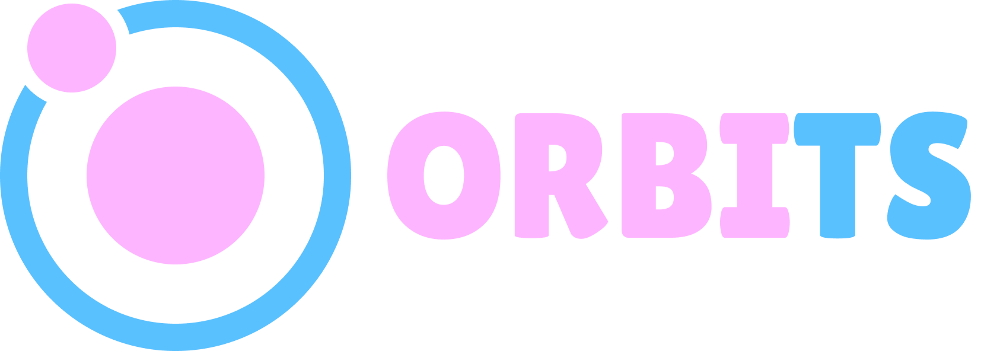

<p align="center">
  
</p>

# Orbits
Keep your orbit in the cloud galaxy! A typescript framework for DevOps workflow.

## Documentation

Read the documentation [here](./pages/main.md).

## Install

### Requirements

- Node.js v16
- MongoDb v4
- (optional but strongly recommended) Docker

#### Database

Orbits, at this stage, only supports mongodb as database.
To get a mongodb connection, you can:
- deploy mongo in local (in this case, you will need to opt for the `replicaset` configuration)
- use a Mongo Atlas cluster (you can start with a free cluster)
- use the [docker compose](./docker-compose.yml) file.

### Docker compose

You can use the `docker-compose.yml` file in order to run your app.
- Put the [docker compose](./docker-compose.yml) file at the root of your Orbits directory (for example, at `./src/examples/basic-bash-example`)
- launch a docker-compose process with the `docker compose up` command.
If you opt for this way of working, you still need to [install the dependencies](#standard-installation)

### Standard installation

```bash
npm install @wbce/orbits-core @wbce/orbits-fuel
```

### Minimal installation
```bash
npm install @wbce/orbits-core
```

## Testing
In each specific package, go to the `/specs/` folder. There is a `main.spec.ts`.
In the jasmine configuration, choose the specs you want to run and then run:
```bash
npx ts-node-dev main.spec.ts
```

## Contributing
This repository is open to contributions on all its forms.

### Repository folders
This git repository manages three packages:
- the core package is under `/src/core/actions`
- the fuel package is under `/src/helpers`
- the service package is under `/src/packages/services`

Also, there is a `/src/examples` folder with some examples.

## Roadmap

> We will formalize this roadmap with a more appropriate tool soon or later. At this stage, you can suggest modification by opening an issue, opening a pull request, or [contacting us](#contact-us).

* Executors:
  - complete the docker executor to build the image from a Dockerfile
  - add an AWS ECS executor
  - add a lambda executor
* Git integration:
  - simplify the process to manage a git repository, add git hooks...
  - add Waiters for main git steps (PR, release...)
* Api integration:
  - write an example with the API helper
  - add a better way to interact with Orbits via API
* Secrets:
  - propose an integration with a vault
* IAM and Aws Integration:
  - propose a way to have granular permission at the level of the Action

## Contact us
You can contact us to give us feedback or in case of problems:
equipe@webcapsule.io
