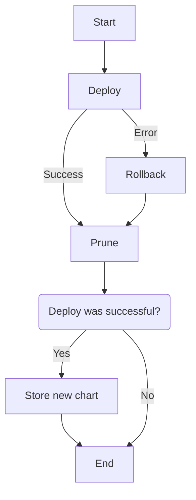

# Model-driven orchestration of cdk8s

[Cdk8s](https://cdk8s.io/) is a great tool to write your Kubernetes IaC templates using standard programming languages. But unlike the [AWS cdk](https://aws.amazon.com/fr/cdk/), which is tightly integrated with CloudFormation to manage stack deployment, cdk8s has no native deployment mechanism.

By default, it allows you to synthesize manifests and deploy them using `kubectl apply`, or optionally through [Helm](https://helm.sh/). While both approaches can work, they often fall short for more advanced use cases — for example, when you want to programmatically chain deployments, export values from the chart, or implement a custom rollback and prune strategy.

In this blog post, we’ll explain how we built a model-driven orchestrator for cdk8s using Orbits — a lightweight framework for orchestrating cloud resources and workflows. We’ll show how you can use it, adapt it to your own needs, or even build your own orchestrator based on the same principles. If Orbits fits your use case, you can directly reuse what we’ve built.

<!-- truncate -->

## The Need for cdk8s orchestration

There is no built-in way to programmatically and reliably deploy a cdk8s stack — especially outside of the AWS ecosystem.

The current options are:

- Synthesize the stack and apply it with `kubectl apply`
- Deploy the stack as a Helm chart

But both of these have shortcomings:

- They are not easily orchestrated programmatically;
- Helm has known limitations when integrating with cdk8s;
- There’s no native support for retries, failover, or rollback;
- There is no built-in mechanism to chain the deployment of multiple charts, especially if some charts are on one kube cluster and other on another kube ;cluster
- Helm’s rollback model didn’t align with our platform needs.

In our case — building internal platforms for highly regulated environments — we needed more control. Our deployment flow had to:

- Configure cloud provider resources via API calls;
- Deploy multiple charts programmatically in a precise order;
- Use the results of deployments (like IPs or service names) to configure other infrastructure components.

Given these needs, existing options were simply not enough.
What we were looking for resembled the CloudFormation model:

- Attempt a deployment;
- Rollback to the previous state on failure;
- On success, prune obsolete resources;
- Output values that could be reused in subsequent steps.

Additionally, we needed:

- Safe concurrent executions, to allow multiple deployments at the same time without conflict;
- Built-in retry policies for transient failures.

These requirements led us to build a dedicated orchestrator for cdk8s using Orbits — a model-driven orchestration engine designed for reliability and composability.

## Final result

The result is an Orbits agent that manages your cdk8s deployment.
You can read the [orbits documentation](/documentation/helper/integrations/cdk8s-agent) on how to use it.

- You can use it by extending the base class:

```ts
export class BasicAgent extends Cdk8sAgent {
    StackConstructor = BasicChart;
}
```

- Or dynamically assign a custom stack generation method:

```ts
const myCdk8sAgent = new Cdk8sAgent();
myCdk8sAgent.generateStack = () => {
    return new cdk8s.Chart(myCdk8sAgent.app, 'empty-chart');
};

await this.do('update-stack', { dynamicAction: myCdk8sAgent });
```

:::info Outputs
You can export outputs, which allows you to chain charts or propagate values (like an IP address for DNS updates)

```ts
async setOutput() {
    const stack = await this.generateStack();
    const apiServiceInfo = await this.kubeApi.coreApi.readNamespacedService({
        name: stack.loadBalancerService.name,
        namespace: stack.loadBalancerService.metadata.namespace || 'default',
    });
    return apiServiceInfo.status.loadBalancer.ingress[0].ip;
}
```

:::

:::info Concurrency
Concurrency is also managed by Orbits. If a deployment is already running, concurrent executions will be serialized to prevent state corruption

```ts
// somewhere
this.do('deploy', new MyBasicChartAgent());
// elsewhere
this.do('deploy', new MyBasicChartAgent());
```

The two deployments will [coalesce](/documentation/core-concepts/agent#convergent-execution-coalescing).
:::

:::info Crash-proof
Orbits is [crash-proof](/documentation/quickstart#workflow-a-chain-of-actions).
If a crash occurs mid-deployment, Orbits will resume from the same step on restart.
:::

## Implementation

From a cdk8s chart, we want to:

- Deploy the chart reliably
- Retry on failure
- Rollback to the previous state if necessary
- Prune obsolete resources

### The orbits Cdk8s agents

In Orbits, [agents](/documentation/core-concepts/agents) are stateful units that define hooks like defineUpdate.
For the deployment of a cdk8s chart, we only need the `update` hook.
The high-level flow of the agent implementation is as follows:

```ts
export class Cdk8sAgent {
    async defineUpdate() {
        try {
            await this.do("deploy", ...);
        } catch (err) {
            this.bag.rollBackNeeded = true;
            await this.do("rollback", ...);
        } finally {
            await this.do("prune", ...);
        }

        if (!this.bag.rollBackNeeded) {
            await this.do("storeNewChart", ...);
        }
    }
}
```



The complete implementation is available [here on github](https://github.com/LaWebcapsule/orbits/blob/main/helpers/src/standards-agent/cdk8s/cdk8s-agent.ts)

#### Deploying the chart

There are multiple ways to deploy a stack, but we chose `kubectl apply` because it updates only the resources that changed. That means kubectl is required in the environment running the deployment.

#### Ensuring the deployment is successful

We don’t just fire and forget. We verify that critical resources are ready:

- All Deployments reach a ready state;
- Certificates (e.g., from cert-manager) are marked as ready.
  This check helps us ensure the cluster is in a stable and usable state before moving forward.

#### Storing the latest chart

We store the chart contents in a Kubernetes Secret. The secret’s name is generated based on the stack name:

```ts
private genSecretName(): string {
        return `orbits.deployment.${this.argument.stackName}`;
}
```

This allows the system to compare the current state with the previous one during rollback or pruning.

#### Pruning unused resources

Pruning depends on whether the deployment succeeded:

- On success, we prune old resources;
- On failure, we prune newly created resources.

We compare the list of objects in the stored stack with the current state and remove the unneeded ones.
We make sure to never delete:

- Namespaces
- PersistentVolumeClaims

### Key Benefits

- CloudFormation-like rollback for Cdk8s chart
- Crash-safe and retryable deployments
- Safe concurrent operations
- Outputs and dependency chaining support
- Multi-tenants deployment support

## Looking Forward

Our orchestrator provides a robust and flexible foundation for managing cdk8s deployments in production. While it already solves some pain points, we plan to improve:

- Improved diff tools to preview changes before applying them
- Extended tracking and monitoring of additional Kubernetes resources
  Additionally, the agent offers a promising starting point for implementing drift detection, but that topic will be covered in a future post.

---

_The source code of the CDk8SAgent is available here: [https://github.com/LaWebcapsule/orbits/blob/main/helpers/src/standards-agent/cdk8s/cdk8s-agent.ts](https://github.com/LaWebcapsule/orbits/blob/main/helpers/src/standards-agent/cdk8s/cdk8s-agent.ts)_
