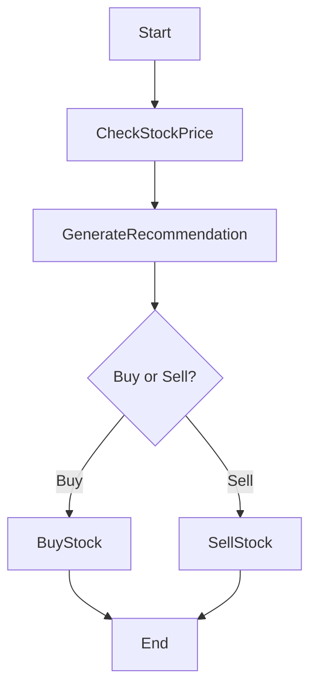

# Orchestration, Resilience and Microservices

In a world where applications are increasingly distributed, modeling robust and resilient business processes is essential. Between API calls, network errors, conditional logic, and automatic recovery needs, managing a simple workflow can quickly become a technical nightmare.

What if we could simplify all of this, make it more enjoyable for developers, and fully integrate it with Node.js?

In this article, we share our experience implementing business workflows in Node.js using the **Orbits** engine, a solution that allows you to express your business processes as declarative code.

<!-- truncate -->

## Why explicitly orchestrate workflows?

Let's take a common use case in a business application: **managing a stock trading transaction**.

Here are the typical steps:
1. Check the price of a stock
2. Generate a buy or sell recommendation
3. Execute the recommended action

On the surface, these are simple asynchronous calls that could be chained in a function:

```javascript
async function trade() {
  const stockPrice = await checkPrice();
  const recommendation = await generateRecommendation(stockPrice);
  return recommendation === 'buy' ? await buyStock(stockPrice) : await sellStock(stockPrice);
}
```

But in reality, problems accumulate:
- What to do if a third-party service fails?
- How to trace the operation state at each step?
- Is it possible to resume execution after a crash?
- How to ensure an operation was only partially completed?
- And most importantly: **how to guarantee process consistency in a distributed system?**

## The Orchestrated Saga Pattern

The **Orchestrated Saga pattern** effectively addresses these challenges. By centralizing workflow management in an orchestrator, this pattern allows breaking down the global transaction into a series of atomic actions, executed sequentially and in a controlled manner.

The orchestrator:
- Explicitly manages state transitions between each step
- Persists workflow state to ensure recovery after crashes
- Implements compensation mechanisms (logical rollback) in case of failure
- Provides fine-grained traceability through clear step naming

Thus, the Orchestrated Saga pattern not only guarantees resilience and consistency of operations but also facilitates maintenance, monitoring, and evolution of complex workflows in a distributed environment.

## Implementation

Orbits proposes writing workflows in a structured and declarative manner.

Here's a concrete example:

```typescript
export class TradingWorkflow extends Workflow {
    async define() {
        const resultCheckStockPrice = await this.do("check-stock-price", new CheckStockPriceAction());
        const stockPrice = resultCheckStockPrice.stockPrice;
        
        const recommendationResult = await this.do("generate-recommendation", 
            new GenerateBuySellRecommendationAction().setArgument({ price: stockPrice.stock_price }));
        const decision = recommendationResult.buyOrSellRecommendation;
        
        if (decision === 'sell') {
            return await this.do("sell-stock", new SellStockAction().setArgument({ price: stockPrice.stock_price }));
        } else {
            return await this.do("buy-stock", new BuyStockAction().setArgument({ price: stockPrice.stock_price }));
        }
    }
}
```

This central workflow orchestrates each step by calling autonomous **Actions**, while maintaining branching logic and intermediate states.

- **Explicit orchestration**: The Orbits engine manages calls, errors, retries, and state persistence
- **Atomic actions**: Each business step is an independent and testable action
- **Conditional branching**: The workflow flow can diverge based on data (buy or sell)
- **Extensibility**: We can easily add steps, compensation logic, monitoring
- **Resilience**: Recovery after crash, state management, built-in observability

Each step is defined as an **Orbits Action**.

Here's the implementation of the buy action:

```typescript
export class BuyStockAction extends Action {
    async main() {
        const response = await fetch(API_ADDRESS + 'buyStock', {
            method: 'POST',
            headers: { 'Content-Type': 'application/json' },
            body: JSON.stringify({ stock_price: this.argument.price })
        });
        this.result.stockData = await response.json();
        return ActionState.SUCCESS;
    }
}
```

This action:
- Takes a **typed input** (price)
- Calls a remote API in an encapsulated manner
- **Returns a state - ActionState.SUCCESS**, ready to be recorded and resumed
- Handles **errors by default via a state - ActionState.ERROR**

This structuring makes the action not only **easy to test in isolation** but also **reusable in different workflows**, while simplifying its instrumentation for monitoring or debugging.

## Workflow Visualization

Here's a schematic representation of the orchestrated process:



## Benefits Summary

Adopting Orbits offers:

**Clear separation of responsibilities**
- **Workflow** = orchestration
- **Action** = unit business logic

**Flexibility & Scalability**
- We can modify the flow without touching business components
- Actions are reusable in multiple workflows

**Resilience and recovery**
- Orbits manages state persistence
- Automatic recovery from the last valid point

**Native observability**
- Each action is traceable, named, monitorable

## Conclusion

Modeling robust business workflows in a distributed environment is a challenge — but not an inevitability. With the simplicity of **Orbits in Node.js**, we can build systems that are reliable, readable, and maintainable.

If you're working on critical processes — e-commerce, finance, logistics, etc. — **adopting such an approach will provide you with a significant structural advantage**.

---

*Learn more about Orbits and its capabilities in our [documentation](/documentation/quick-start).*