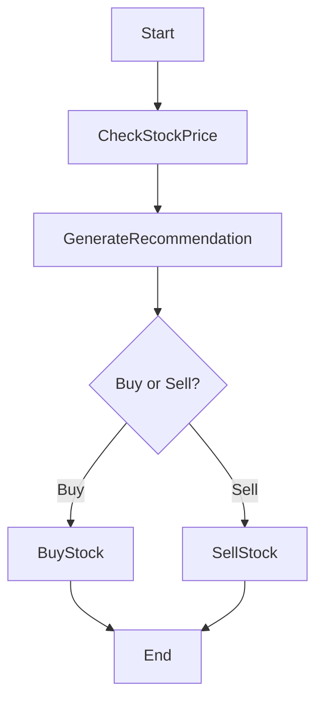

# Write Node.js workflows to orchestrate microservices.

Databases follow the principle of transactions — a set of changes that must either all succeed or all fail. But when an application interacts with multiple databases or connects to various APIs (as is the case for most applications today), the guarantees of ACID are lost. Workflows, state machines, and the saga pattern help achieve a similar level of reliability, often at the cost of more complex code. Here, we introduce a **Node.js** framework that makes it easy to write such workflows in TypeScript.

<!-- truncate -->

## Why explicitly orchestrate workflows?

Let's take a common use case in a business application: **managing a stock trading transaction**.

Here are the typical steps:
1. Check the price of a stock
2. Generate a buy or sell recommendation
3. Execute the recommended action

On the surface, these are simple asynchronous calls that could be chained in a function:

```javascript
async function trade() {
  const stockPrice = await checkPrice();
  const recommendation = await generateRecommendation(stockPrice);
  return recommendation === 'buy' ? await buyStock(stockPrice) : await sellStock(stockPrice);
}
```

But in reality, problems accumulate:
- What to do if a third-party service fails?
- What if a network error occurs?
- If the Node.js process is interrupted, the trade stops halfway, with no memory of the ongoing buy/sell operation.

These issues, far from being theoretical, can have financial consequences. For example, a buy or sell action that is forgotten or left halfway through can lead to losses for the company.

## The Orchestrated Saga Pattern

The **Orchestrated Saga Pattern** effectively addresses these challenges. By centralizing workflow management in an orchestrator, this pattern mimics the transaction principle of a database. It allows a series of atomic actions, executed sequentially and under control, to be linked together into a global transaction.

The orchestrator:
- Explicitly manages state transitions between each step.
- Persists workflow state to ensure recovery after crashes.
- Can replay actions in case of transient failure.
- Provides detailed traceability through clear naming of each step.

Thus, the Orchestrated Saga pattern not only guarantees resilience and consistency of operations but also facilitates maintenance, monitoring, and evolution of complex workflows in a distributed environment.

## Use Case

In this blog post, we revisit the example of orchestrating a banking transaction. This canonical example was provided by [AWS Step Functions](https://docs.aws.amazon.com/step-functions/latest/dg/sample-lambda-orchestration.html) and [Temporal](https://temporal.io/blog/temporal-replaces-state-machines-for-distributed-applications). Readers can refer to these articles to compare the syntax and ease of implementation offered by each tool.

## The Implementation

Orbits proposes writing workflows in a structured and declarative manner.

Here's a concrete example:

```typescript
export class TradingWorkflow extends Workflow{

    declare IResult:StockTransaction

    async define(){
        const resultCheckStockPrice = await this.do("check-stock-price", new CheckStockPriceAction());
        const stockPrice = resultCheckStockPrice.stockPrice;

        const resultGenerateBuySellRecommendationAction = await this.do("check-stock-price", new GenerateBuySellRecommendationAction().setArgument(
            {
                price:stockPrice.stock_price
            })); 

        const buyOrSellRecommendation : string = resultGenerateBuySellRecommendationAction.buyOrSellRecommendation

        if (buyOrSellRecommendation === 'sell') {
             const resultSellStockData = await this.do("sell-stock", new SellStockeAction().setArgument({
                price:stockPrice.stock_price
            }));
            return resultSellStockData.stockData;
        } else {
             const resultBuyStockData = await this.do("buy-stock", new BuyStockAction().setArgument({
                price:stockPrice.stock_price
            }));
            return resultBuyStockData.stockData;
        }

    };
}

```

This central workflow orchestrates each step by calling autonomous **Actions**, while maintaining branching logic and intermediate states.

- **Explicit orchestration**: The Orbits engine manages calls, errors, retries, and state persistence
- **Atomic actions**: Each business step is an independent and testable action
- **Conditional branching**: The workflow flow can diverge based on data (buy or sell). It does not differ from standard TypeScript code.
- **Extensibility**: We can easily add steps, compensation logic, monitoring
- **Resilience**: Recovery after crash, state management, built-in observability

Each step is defined as an **Orbits Action**.

Here's the implementation of the buy action:

```typescript
export class BuyStockAction extends Action {
    async main() {
        const response = await fetch(API_ADDRESS + 'buyStock', {
            method: 'POST',
            headers: { 'Content-Type': 'application/json' },
            body: JSON.stringify({ stock_price: this.argument.price })
        });
        this.result.stockData = await response.json();
        return ActionState.SUCCESS;
    }
}
```

This action:
- Takes a **typed input** (price)
- Calls a remote API in an encapsulated manner
- **Returns a state - ActionState.SUCCESS**, ready to be recorded and resumed
- Handles **errors by default via a state - ActionState.ERROR**

This structuring makes the action not only **easy to test in isolation** but also **reusable in different workflows**, while simplifying its instrumentation for monitoring or debugging.

## Workflow Visualization

Here's a schematic representation of the orchestrated process:



## Benefits Summary

Adopting Orbits offers:

**Standard TypeScript**

Orbits is a standard TypeScript framework. You write promises and asynchronous functions just like you would anywhere else.

**Clear separation of responsibilities**
- **Workflow** = orchestration
- **Action** = unit business logic

**Flexibility & Scalability**
- We can modify the flow without touching business components
- Actions are reusable in multiple workflows

**Resilience and recovery**
- Orbits manages state persistence
- Automatic recovery from the last valid point

**Native observability**
- Each action is traceable, named, monitorable

## Conclusion

With the simplicity of **Orbits in Node.js**, we can build systems that are reliable, readable, and maintainable, without changing your coding practices.

For your critical processes — e-commerce, finance, logistics, etc. — **adopting such an approach will significantly reduce your bug rate and inconsistencies**.

---

*Learn more about Orbits and its capabilities in our [documentation](/documentation/quick-start).*