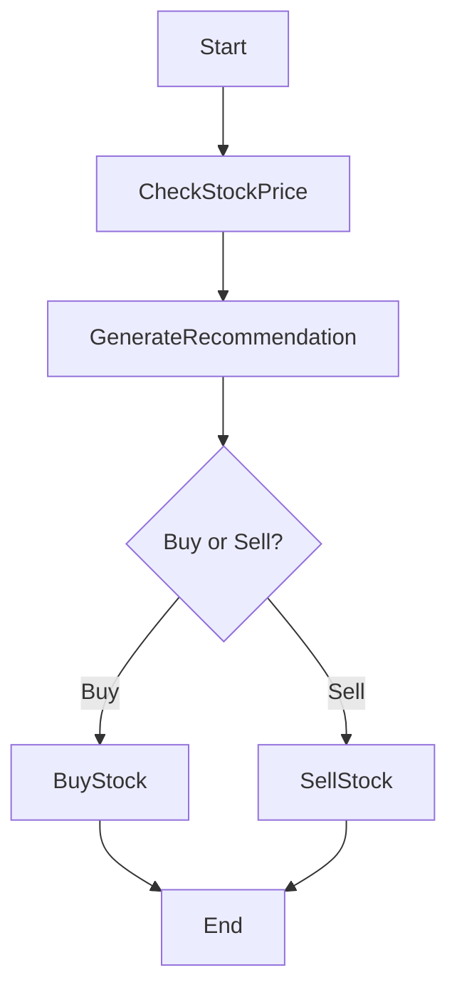

# Write Node.js workflows to orchestrate microservices

Databases follow the principle of transactions — a set of changes that must either all succeed or all fail. But when an application interacts with multiple databases or connects to various APIs (as is the case for most applications today), the guarantees of ACID are lost. Workflows, state machines, and the saga pattern help achieve a similar level of reliability, often at the cost of more complex code. Here, we introduce a **Node.js** framework that makes it easy to write such workflows in TypeScript.

To follow along, you can find the full source code in [Orbit’s GitHub repository](https://github.com/LaWebcapsule/orbits/tree/main/samples/orchestrate-lambda).

<!-- truncate -->

## Why explicitly orchestrate workflows?

Let's take a common use case in a business application: **managing a stock trading transaction**.

Here are the typical steps:

1. Check the price of a stock
2. Generate a buy or sell recommendation
3. Execute the recommended action

On the surface, these are simple asynchronous calls that could be chained in a function:

```ts
async function trade() {
    const stockPrice = await checkPrice();
    const recommendation = await generateRecommendation(stockPrice);
    return recommendation === 'buy'
        ? await buyStock(stockPrice)
        : await sellStock(stockPrice);
}
```

But in reality, problems accumulate:

- What to do if a third-party service fails?
- What if a network error occurs?
- If the Node.js process is interrupted, the trade stops halfway, with no memory of the ongoing buy/sell operation.

These issues, far from being theoretical, can have financial consequences. For example, a buy or sell action that is forgotten or left halfway through can lead to losses for the company.

## The Saga Orchestration Pattern

The [**Saga Orchestration Pattern**](https://microservices.io/patterns/data/saga.html) effectively addresses these challenges. By centralizing workflow management in an orchestrator, this pattern mimics the transaction principle of a database. It allows a series of atomic actions, executed sequentially and under control, to be linked together into a global transaction.

The orchestrator:

- Explicitly manages state transitions between each step;
- Persists workflow state to ensure recovery after crashes;
- Can replay actions in case of transient failure;
- Provides detailed traceability through clear naming of each step.

Thus, the Saga Orchestration pattern not only guarantees resilience and consistency of operations but also facilitates maintenance, monitoring, and evolution of complex workflows in a distributed environment.

## Use Case

In this blog post, we revisit the example of orchestrating a banking transaction. This canonical example was provided by [AWS Step Functions](https://docs.aws.amazon.com/step-functions/latest/dg/sample-lambda-orchestration.html) and [Temporal](https://temporal.io/blog/temporal-replaces-state-machines-for-distributed-applications). Readers can refer to these articles to compare the syntax and ease of implementation offered by each tool.

## The Implementation

Orbits proposes writing workflows in a structured and declarative manner.
You can explore and experiment with the full source code of the example described in this blog post in [Orbit’s GitHub repository](https://github.com/LaWebcapsule/orbits/tree/main/samples/orchestrate-lambda).  
Here's the concrete example:

```ts title="src/orbits/workflows/trading.ts" wordWrap=true
export class TradingWorkflow extends Workflow {
    declare IResult: StockTransaction;

    async define() {
        const checkPrice = await this.do(
            'check-price',
            new CheckStockPriceAction()
        );
        const stockPrice = checkPrice.stockPrice;

        const buyOrSell = await this.do(
            'recommendation',
            new GenerateBuySellRecommendationAction().setArgument({
                price: stockPrice.stock_price,
            })
        );

        if (buyOrSell.buyOrSellRecommendation === 'sell') {
            const sell = await this.do(
                'sell',
                new SellStockAction().setArgument({
                    price: stockPrice.stock_price,
                })
            );
            return sell.stockData;
        } else {
            const buy = await this.do(
                'buy',
                new BuyStockAction().setArgument({
                    price: stockPrice.stock_price,
                })
            );
            return buy.stockData;
        }
    }
}
```

This central workflow orchestrates each step by calling autonomous **Actions**, while maintaining branching logic and intermediate states.

- **Explicit orchestration**: The Orbits engine manages calls, errors, retries, and state persistence
- **Atomic actions**: Each business step is an independent and testable action
- **Conditional branching**: The workflow flow can diverge based on data (buy or sell). It does not differ from standard TypeScript code.
- **Extensibility**: We can easily add steps, compensation logic, monitoring
- **Resilience**: Handles crash recovery, workflow state, and observability

Each step is defined as an **Orbits Action**.

Here's the implementation of the buy action:

```ts
export class BuyStockAction extends Action {
    async main() {
        const response = await fetch(API_ADDRESS + 'buyStock', {
            method: 'POST',
            headers: { 'Content-Type': 'application/json' },
            body: JSON.stringify({ stock_price: this.argument.price }),
        });
        this.result.stockData = await response.json();
        return ActionState.SUCCESS;
    }
}
```

This action:

- Takes a **typed input** (price)
- Calls a remote API in an encapsulated manner
- **Returns a state - ActionState.SUCCESS**, ready to be recorded and resumed
- Handles **errors by default via a state - ActionState.ERROR**

This structuring makes the action not only **easy to test in isolation** but also **reusable in different workflows**, while simplifying its instrumentation for monitoring or debugging.

## Workflow Visualization

Here's a schematic representation of the orchestrated process:



## Benefits Summary

Adopting Orbits offers:

**Standard TypeScript**

Orbits is a standard TypeScript framework. You write promises and asynchronous functions just like you would anywhere else.

**Clear separation of responsibilities**

- **Workflow** = orchestration
- **Action** = unit business logic

**Flexibility & Scalability**

- We can modify the flow without touching business components
- Actions are reusable in multiple workflows

**Resilience and recovery**

- Orbits manages state persistence
- Automatic recovery from the last valid point

**Native observability**

- Each action is traceable, named, monitorable

## Going further

### Using lambdas async invocations

For the sake of hypothesis, let’s assume our Lambda function runs for an extended period of time (which is not the case here). In such scenarios, there’s a high chance that the initial HTTP call triggering the Lambda might fail unexpectedly—due to a network issue or timeout, for example.

To prevent such failures from disrupting the overall workflow, you can configure retry policies.

Orbits also supports asynchronous APIs and allows you to track execution status over time. When dealing with long-running Lambda functions, an Orbits action can return with an `ActionState.IN_PROGRESS`, and then delegate the follow-up logic to the `watcher()` [method](/documentation/core-concepts/action), which periodically checks the progress of the async process.

This approach requires a bit of additional setup, as you’ll need to interact with the AWS Lambda API to track the specific invocation’s result.

We’ll cover how Orbits makes it easy to manage long-running processes in a dedicated blog post soon.

### Using resources to manage concurrency

In our example, if we trigger the same order twice, it will be processed twice—this isn’t always the desired behavior.
Orbits provides an opinionated way to handle concurrency through a concept called resources. [Resources](/documentation/core-concepts/resource) allow you to control and limit the execution of actions to prevent unintended duplication.

## Conclusion

With the simplicity of **Orbits in Node.js**, we can build systems that are reliable, readable, and maintainable, without changing your coding practices.

For your critical processes — e-commerce, finance, logistics, etc. — **adopting such an approach will significantly reduce your bug rate and inconsistencies**.

---

_Learn more about Orbits and its capabilities in our [documentation](/documentation/quick-start)._
