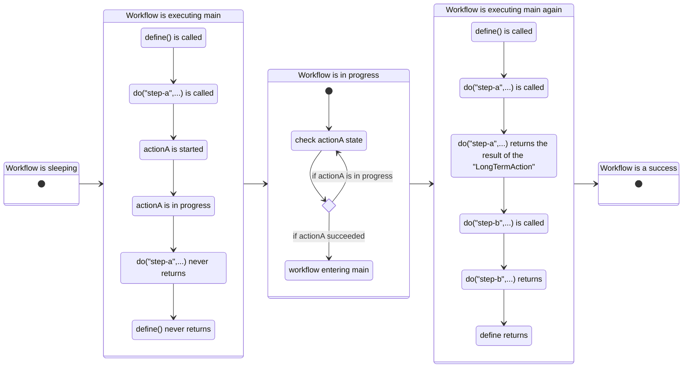

# Workflow documentation

A Workflow is a way to chain Actions. The syntax is similar to how async/await syntax works.
A Workflow is also a specific type of `Action`, so you can chain Workflows in other Workflows.


## Write a Workflow

A Workflow, same as an `Action`, has an `init()` method.
A Workflow also has a `define()` method where you can write your flow of Actions.

```ts
export class MyWorkflow extends Workflow {
    define() {
        try {
            await this.do(
                'my-action',
                new MyAction().setArgument({
                    x: 1,
                })
            );
        } catch (err) {
            await this.do(
                'on-error-action',
                new OnErrorAction().setArgument({
                    x: 1,
                })
            );
        } finally {
            //....
        }
        return {
            x: 2,
        };
    }
}
```

### The do method

#### Purpose

The `do()` method is used to declare an action to be executed within the workflow. It mimics the behavior of await in native JavaScript/TypeScript syntax to provide readable, sequential flow control.

However, `do()` is more complex than a normal asynchronous call. Behind the scenes, the orbits framework implements deterministic execution with built-in replayability. This means:

- `define()` can be executed multiple times during the lifecycle of a workflow.
- Each call to `do()` is idempotent: the action is only executed once.
- On re-execution, previously completed `do()` calls return the stored result instead of re-running the action.

#### Point of attention: deterministic execution and async/await

:::warning Incorrect

```ts
export class BadWorkflow extends Workflow {
    define() {
        const search = await axios.get('https://google.com?search=test'); // ❌ Not deterministic
        if (search.length) {
            await this.do('step-a', new StepA());
        } else {
            await this.do('step-b', new StepB());
        }

        return { status: 'done' };
    }
}
```

:::

:::success Correct

```ts
export class CorrectWorkflow extends Workflow {
    define() {
        const search = await this.do('search', () => {
            axios.get('https://google.com?search=test');
        });

        if (search.length) {
            await this.do('step-a', new StepA());
        } else {
            await this.do('step-b', new StepB());
        }

        return { status: 'done' };
    }
}
```

:::

:::warning Incorrect

```ts
export class BadWorkflow extends Workflow {
    define() {
        const now = Date.now(); // ❌ Not deterministic

        if (now % 2 === 0) {
            await this.do('step-a', new StepA());
        } else {
            await this.do('step-b', new StepB());
        }

        return { now };
    }
}
```

:::

:::success Correct

```ts
export class CorrectWorkflow extends Workflow {
    IBag: {
        now: number;
    };

    async init() {
        await super.init();
        if (!this.bag.now) {
            this.bag.now = Date.now();
        }
    }

    define() {
        if (this.bag.now % 2 === 0) {
            await this.do('step-a', new StepA());
        } else {
            await this.do('step-b', new StepB());
        }

        return { now: this.bag.now };
    }
}
```

:::

### Action Step definition

The `do()` method accepts an `Action` instance as its argument:

```ts
await this.do('step-a', new MyAction().setArgument({ some: 'argument' }));
```

The action will be persisted in the database and executed in an isolated context.

- The result of the `await` will be the result of the action.
- If the final action's state is `ActionState.ERROR`, the `do()` method will throw the error — allowing standard error handling using try/catch.

### On the fly promise definition

The `do()` method also accepts a callback that returns a Promise.

```ts
await this.do('step-a', () => {
    return Promise.resolve();
});

await this.do('step-b', myAsyncFunction.bind('some', 'argument'));
```

- The promise will be executed once and only once.
- The result of the await will be the resolved value of the promise.
- If an error occurs, it will be thrown by `do()` and can be handled via `try/catch`.

### Dynamic definition

Dynamic definitions are useful when you need to pass non-serializable parameters, such as functions.
Since actions are stored in the database, only `JSONObject`-compatible properties can be persisted.
To pass methods or closures through the chain of actions, use the `dynamicAction` option:

```ts
const action = new MyAction();
// override a method of your action
action.getCredentials = () => this.specificConfig.getCredentials();
await this.do('step-a', { dynamicAction: action });
```

The action will be persisted in the database and executed in an isolated context.
When executed, `getCredentials` will be overridden with this definition specific to the workflow context.

- The result of the `await` will be the result of the action.
- If the final action's state is `ActionState.ERROR`, the `do()` method will throw the error — allowing standard error handling using try/catch.

### Under the hood

Under the hood, the `do` method returns a standard JavaScript promise.
However this promise does not always resolve.

Let's say we have a workflow with two steps:

```ts
export class MyWorkflow extends Workflow {
    define() {
        const actionA = new LongTermAction();
        const result = await this.do('step-a', actionA);
        await this.do('step-b', new MyAction().setArgument(result));
    }
}
```

Here is the flow of calls that happens.



## Repeat and transform

### Action level

At the action level, you can configure the repetition using the `setRepeat()` method.
Example:

```ts
export class MyWorkflow extends Workflow {
    define() {
        try {
            await this.do(
                'my-action',
                new MyAction()
                    .setArgument({
                        x: 1,
                    })
                    .setRepeat({
                        [ActionState.ERROR]: 2, // repeat twice, so will be executed max. 3 times
                    })
            );
        } catch (err) {
            await this.do(
                'on-error-action',
                new OnErrorAction().setArgument({
                    x: 1,
                })
            );
        } finally {
            //....
        }
        return {
            x: 2,
        };
    }
}
```

### Workflow level

At the workflow level, you can configure the repetition using the `repeatDo()` method.
Example:

```ts
export class WorkflowWithRepeat extends Workflow {
    async define() {
        await this.repeatDo(
            'repeatSuccess',
            () => {
                //...do something...
                return Promise.resolve();
            },
            {
                [ActionState.SUCCESS]: 2,
                elapsedTime: 10,
            }
        );

        try {
            await this.repeatDo(
                'repeatOnFailure',
                () => {
                    //...do something...
                    return Promise.reject();
                },
                {
                    [ActionState.ERROR]: 2,
                    elapsedTime: 10,
                }
            );
        } catch (err) {}
        return i;
    }
}
```

### Transformation

The `transform()` method is a powerful hook that intercepts every Action before it is executed by the Workflow.

It acts as a proxy layer over all Actions that pass through the Workflow engine. You can use it to:

- Modify the arguments of any Action;
- Replace one Action with another;
- Apply conditional logic;
- Dynamically set `.setRepeat()`, `.setTimeout()`, `.setBag()`, etc.

This is especially useful when you want to customize or override an Action behavior without changing the Workflow's `define()` logic.

---

#### Examples

##### Simple example

```ts
export class MyWorkflow extends Workflow {
    // The transform method allows you to intercept and modify actions dynamically.
    transform(ref: string, action: Action): Action {
        if (ref === 'my-action') {
            // Override the arguments for the step "my-action"
            return MyAction().setArgument({
                x: 2,
            });
        }

        // Returning `undefined` means the original action instance will be used as-is
        return;
    }

    async define() {
        try {
            await this.do(
                'my-action',
                MyAction()
                    .setArgument({
                        x: 1,
                    })
                    .setRepeat({
                        [ActionState.ERROR]: 2, // Retry up to 2 times on error (executed max 3 times)
                    })
            );
        } catch (err) {
            await this.do(
                'on-error-action',
                OnErrorAction().setArgument({
                    x: 1,
                })
            );
        } finally {
            // You can perform cleanup or additional steps here
        }

        return {
            x: 2,
        };
    }
}
```

_Key Notes_

- The `ref` argument passed to `transform()` matches the name you use in `this.do("my-action", ...)`.
- You must return a valid Action instance if you want to replace or modify it.
- If `transform()` returns `undefined`, the original `Action` provided in `define()` will be used.

_Use this to:_

- Inject environment-specific parameters (e.g. test vs. prod);
- Dynamically change retry logic or timeouts;
- Centralize logic for versioning or conditional behavior.

##### Inheritance example

```ts
export class CustomWorkflow extends BaseWorkflow {
    transform(ref: string, action: Action): Action {
        if (ref === 'notify') {
            // Override the default email step with a custom SMS notification
            return new SendSmsAction().setArgument({
                message: 'This replaces the email notification',
            });
        }
        return;
    }
}
```

This pattern allows you to:

- Reuse shared workflow logic;
- Swap or extend individual steps based on context;
- Build a hierarchy of workflows with consistent interfaces but customizable behavior.
