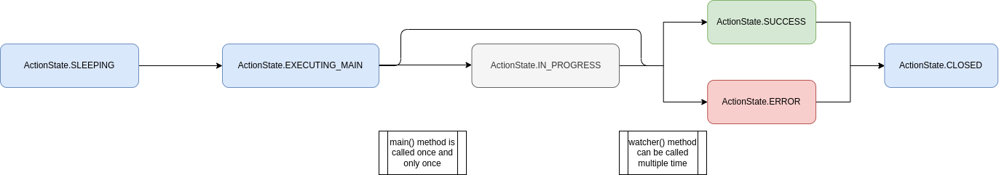

# Action lifecycle

An action has a lifecycle that starts when the action is saved in the database. Then, Orbits takes care of the different states and call the appropriate function when needed, with correct locks and timeouts.

A standard flow would be the following.  

>In some special case, you can customize this flow to better fit your need. For example, the `watcher` can emit an `ActionState.SLEEPING` to return at the begining flow. Be sure to have understood what this implies before doing it. 

# Method to manage the state of an action

## The `resume` method

Each action has a `resume` method. This method call the appropriate flow and functions corresponding to the action state. You can use it if you want to manually update or check for updates to the state of an action.  
This `resume` property is called at regular rate by cron jobs. (see )

## The `init` method

The `init` method is called before any call to the `main` or `watcher` method. It guarantees that the action instance has loaded the correct informations from the databases or other external resources.

## The `main` method

The `main` method is called once and only once, after the action entered in the EXECUTING_MAIN state.
The `main` method should return one of this three states : SUCCESS, ERROR, IN_PROGRESS.

## The `watcher` method

The `watcher` method is called potentially multiple times when the action is in the IN_PROGRESS state.
The `watcher` method should return one of this three states : SUCCESS, ERROR, IN_PROGRESS.
Exceptionnally, it can return the SLEEPING or PAUSED states.

# Flow states and steps

### ActionState.SLEEPING

An action begins in the sleeping state. Nothing will happen before the first call to the  `resume` method. If your action is saved in the database, the Orbits cron will take care of calling `resume` for you.

### ActionState.EXECUTING_MAIN

Come just after the SLEEPING state and before the call to the `main` method. It acts as a lock : only one process can do the transition from SLEEPING to EXECUTING_MAIN state, ensuring the `main` method is called once and only once.   
An action can stay in the EXECUTING_MAIN state during only some delay. This timeout is configured via the `dbDoc.delays[ActionState.EXECUTING_MAIN]`. After the timeout expired, a call to the `watcher` method is done.
See for more infos on how to configure the delays.

## ActionState.IN_PROGRESS

The `main` and `watcher` method can send an ActionState.IN_PROGRESS to mention the action is still pending. When an action is in progress, a call to `resume` will call the `watcher` method. As a consequence, the `watcher` method can be called multiple times.
An action can stay in the IN_PROGRESS state during only some delay. This timeout is configured via the `dbDoc.delays[ActionState.IN_PROGRESS]`. After the timeout expired, the action will enter the ERROR state.
See for more infos on how to configure the delays.

## ActionState.SUCCESS

The action has succeeded. If it is part of a workflow, the workflow will be notified of the success.
It then enter the CLOSED state.

## ActionState.ERROR

The action has failed. If it is part of a workflow, the workflow will be notified of the failure.
It then enter the CLOSED state.

## ActionState.CLOSED

If no rollback is possible, a CLOSED action will be deleted after one day.